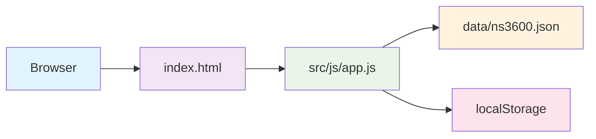

# 🏠 Ekhana Takst - Eiendomstaksering Prototype 🇳🇴

[](https://github.com/ekhanatime/ekhana-takst)
[](LICENSE)
[](#-kjør-prosjektet)

> **Eiendomstaksering gjort enkelt.** En moderne prototype for takstmenn som kombinerer norsk fagkunnskap med fleksibel teknologi.

## 📋 Hva er problemet?

Tradisjonelle takstverktøy er ofte:
- **Rigide** - Fastlåste skjema som ikke tilpasser seg ulike eiendomstyper
- **Komplekse** - Krever omfattende opplæring og spesialisert programvare
- **Dyrt** - Kostbare lisenser og tung infrastruktur
- **Ufleksible** - Vanskelig å tilpasse til nye krav eller standarder

Resultatet? Takstmenn bruker mye tid på administrasjon istedenfor faglig arbeid, og kunder får ikke alltid den beste opplevelsen.

## 🎯 Hvorfor denne løsningen?

**Ekhana Takst** er designet fra bunnen av med **JSON-first**-arkitektur som gjør systemet:

### ✨ Fleksibelt
- **NS3600-standard** som JSON-konfigurasjon
- Enkelt å legge til nye romtyper, bygningsdeler eller kontrollpunkter
- Tilpassbare arbeidsflyter uten kodeendringer

### 🚀 Effektivt
- **Statisk deployment** - Virker på hvilken som helst webserver
- **Offline-kompatibelt** - Ingen backend-avhengigheter
- **Hurtig arbeidsflyt** - Fra TG-valg til ferdig dokumentasjon på sekunder

### 👥 Brukerfokusert
- **Takstmann**: Intuitiv flyt med fremdriftsindikatorer
- **Kunde**: Enkel onboarding og transparent preview
- **Tilgjengelig**: Norsk språk og responsivt design

## 🔧 Hva løser dette?

### For Takstmenn
- ⚡ **Raskere arbeidsflyt** - TG-valg → dokumentasjon → markering som ferdig
- 📊 **Full oversikt** - Se fremdrift per rom og bygningsdel
- 🎯 **Fokus på faglighet** - Intuitivt grensesnitt som ikke distraherer
- 📱 **Mobilvennlig** - Arbeid hvor som helst

### For Kunder
- 🏡 **Enkel onboarding** - Registrer eiendom på noen minutter
- 🗺️ **Interaktivt kart** - Vis adresse og eiendomsinfo
- 👁️ **Transparent preview** - Se taksten underveis
- 📧 **Digital kommunikasjon** - Alt i ett sted

### For Virksomheter
- 💰 **Kostnadseffektivt** - Ingen dyre lisenser eller infrastruktur
- 🔧 **Tilpassbart** - Enkelt å utvide med nye tjenester
- 📈 **Skalerbart** - Statisk hosting som håndterer høy trafikk
- 🔒 **Sikkert** - Ingen databaser eller sensitive data lagret

## 🏗️ Teknisk Arkitektur



### Kjerneteknologier
- **HTML/CSS/JavaScript** - Ren webteknologi, ingen rammeverk-avhengigheter
- **Bootstrap 5** - Moderne, responsivt UI-komponentbibliotek
- **Leaflet** - Interaktive kart for eiendomsvisning
- **JSON-first** - Konfigurasjon-drevet arkitektur

### Nøkkelfunksjoner
- **TG-klassifisering** - NS3600-standard for tilstandsgradering
- **Dynamiske skjema** - UI bygges fra JSON-konfigurasjon
- **Fremdriftssporing** - Per punkt og per rom
- **Modal-basert redigering** - Kompakt og fokusert arbeidsflyt
- **Offline-lagring** - localStorage for utkast

## 🚀 Kjør prosjektet

### Enkelt oppsett
```bash
# 1. Last ned eller klon repository
https://github.com/ekhanatime/ekhana-takst.git

# 2. Åpne index.html i nettleser
open index.html
```

Det er det! Ingen installasjon, bygging eller server nødvendig.

### For utviklere
```bash
# Klone repository
https://github.com/ekhanatime/ekhana-takst.git

# Arbeid med filer
# Alle endringer lagres automatisk i localStorage

# Push endringer
git add .
git commit -m "feat: Legg til ny funksjon"
git push
```

## 📁 Prosjektstruktur

```
/├── index.html                    # Hovedapplikasjon (entry point)
/├── README.md                     # Denne filen
/├── src/
/│   ├── pages/                    # HTML-sider
/│   │   ├── onboarding.html       # Kunde-innhenting
/│   │   └── changelog.html        # Dokumentasjon
/│   └── js/                       # JavaScript-logikk
/│       ├── app.js                # Hovedapplikasjon
/│       ├── onboarding.js         # Onboarding-flyt
/│       └── changelog.js          # Dokumentasjonsviser
/├── assets/
/│   └── css/
/│       └── styles.css            # UI-stiler
/├── docs/                         # Teknisk dokumentasjon
/│   ├── project.md                # Detaljert arkitektur
/│   ├── changelog.md              # Endringshistorikk
/│   └── tasklog.md                # Utviklingslogg
/├── data/                         # JSON-konfigurasjoner
/│   ├── ns3600_fullprofil_v1.0.0.json     # NS3600-standard
/│   ├── example_property.json              # Eksempeldata
/│   └── property_object_generator_rules_v1.0.0.json
/└── .gitignore                    # Git ignore-regler
```

## 🎨 Brukergrensesnitt

### 📱 Responsivt Design
- **Desktop**: Full funksjonalitet med sidepanel
- **Tablet**: Optimalisert for berøring
- **Mobil**: Enkelt, intuitivt grensesnitt

### 🎯 Brukeropplevelse
- **Kunde-visning**: Oversiktlig romliste med areal-info
- **Takstmann-visning**: Detaljert tabell med TG-klassifisering
- **Preview**: Profesjonell presentasjon for kunder

## 🤝 Bidrag og utvikling

### Kom i gang
1. **Fork** repository'et
2. **Klon** din fork: `git clone https://github.com/YOUR_USERNAME/ekhana-takst.git`
3. **Installer** eventuelle dev-verktøy (valgfritt)
4. **Arbeid** med features i separate branches
5. **Test** grundig - åpne `index.html` i forskjellige nettlesere
6. **Commit** med beskrivende meldinger
7. **Push** og lag pull request

### Utviklingsretningslinjer
- 🔧 **JavaScript**: Ren ES6+, ingen rammeverk
- 🎨 **CSS**: BEM-lignende navngiving, CSS-variabler
- 📝 **Dokumentasjon**: Oppdater `docs/` ved endringer
- 🧪 **Testing**: Manuell testing i moderne nettlesere
- 📱 **Tilgjengelighet**: Følg WCAG-retningslinjer

### Mulige bidrag
- 🌍 **Internasjonalisering** - Flere språk støtte
- 📊 **Eksportering** - PDF/PDF-generering
- 🔄 **Synkronisering** - Backend-integrasjon
- 📸 **Bilder** - Foto-håndtering og annotering
- 📋 **Maler** - Tilpassbare takstmaler

## 📊 Status og roadmap

### ✅ Implementert
- [x] JSON-first arkitektur med NS3600
- [x] TG-klassifisering og modal-redigering
- [x] Fremdriftsindikatorer per rom/punkt
- [x] Kunde-onboarding med kartintegrasjon
- [x] Responsivt Bootstrap 5 design
- [x] Offline-lagring i localStorage

### 🚧 Pågående arbeid
- [ ] Bilder og mediehåndtering
- [ ] Eksportering til PDF/Excel
- [ ] Backend-integrasjon
- [ ] Mobilapp-versjon

### 💡 Fremtidsplaner
- [ ] Multi-bruker støtte
- [ ] Realtime samarbeid
- [ ] AI-assistert taksering
- [ ] Integrasjon med offentlige registre

## 📞 Kontakt og støtte

- **Issues**: [GitHub Issues](https://github.com/ekhanatime/ekhana-takst/issues)
- **Diskusjoner**: [GitHub Discussions](https://github.com/ekhanatime/ekhana-takst/discussions)
- **E-post**: For private henvendelser

## 📄 Lisens

Dette prosjektet er lisensiert under **MIT License** - se [LICENSE](LICENSE) for detaljer.

## 🙏 Takk til

- **NS3600** - Norsk standard for bygningstaksering
- **Bootstrap** - UI-komponentbibliotek
- **Leaflet** - Kartbibliotek
- **OpenStreetMap** - Kartdata

---

<div align="center">

**Bygget med ❤️ for norske takstmenn og deres kunder**

[🚀 Prøv demo](index.html) • [📖 Les docs](src/pages/changelog.html) • [🐛 Rapporter feil](https://github.com/ekhanatime/ekhana-takst/issues)

</div>
