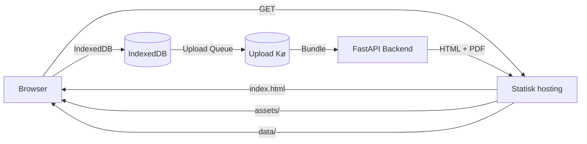
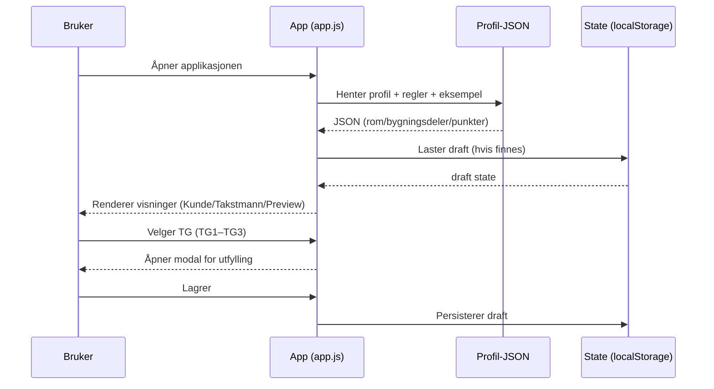
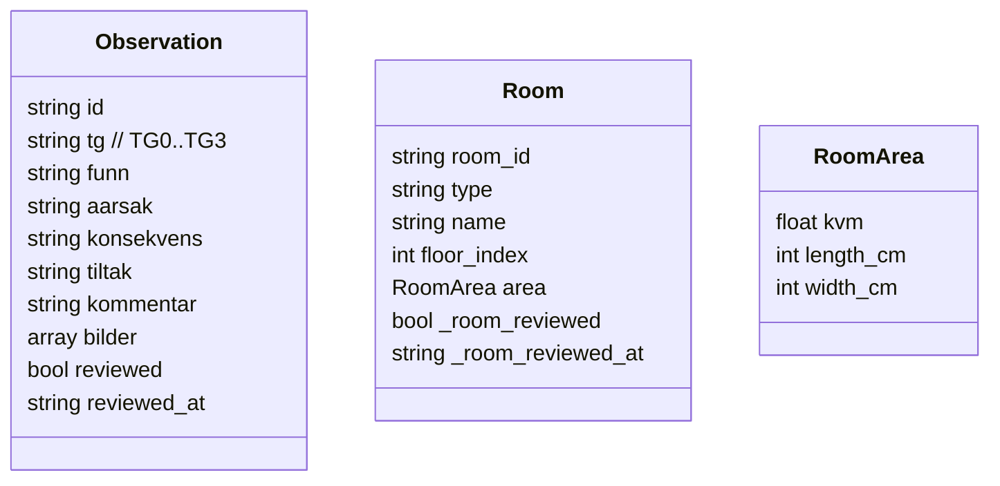
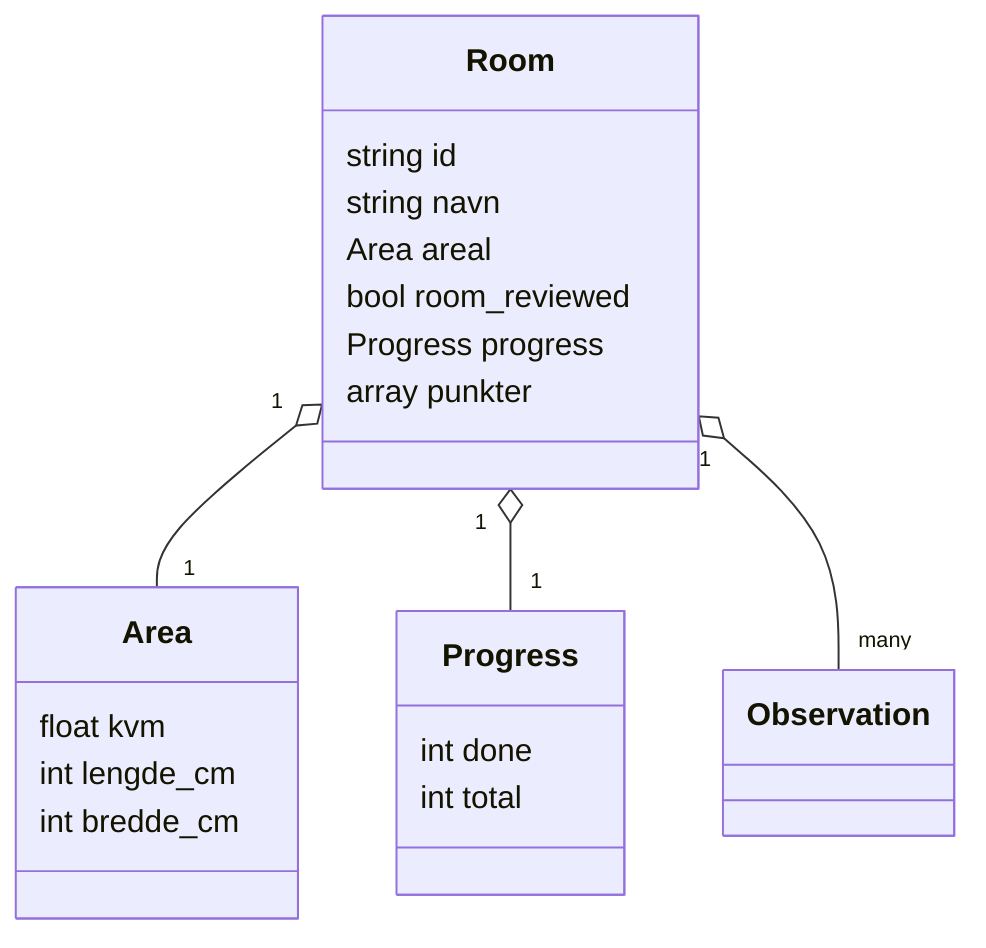
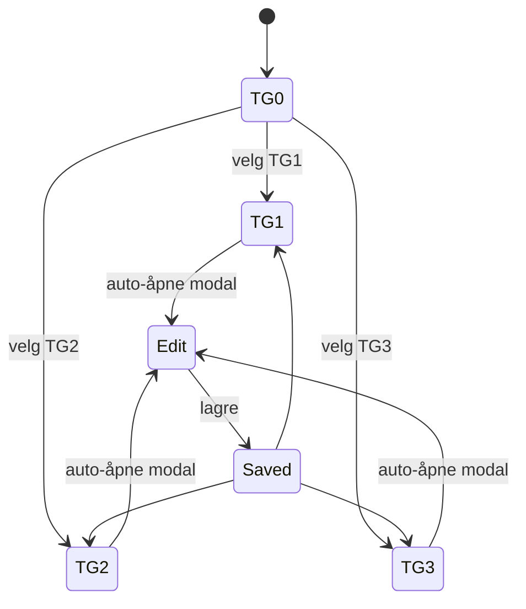
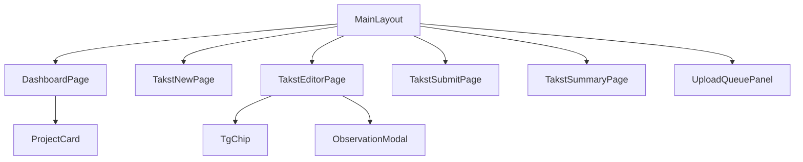
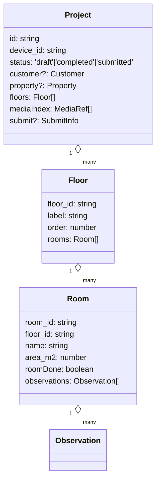
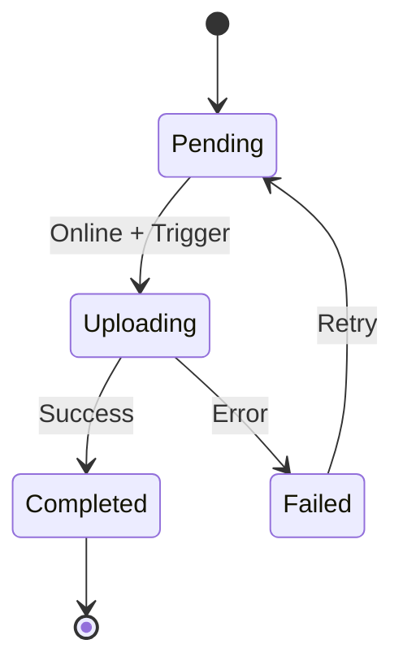

# Ekhana Takst - SPOT (Single Point of Truth)

[](https://github.com/ekhanatime/ekhana-takst)
[](LICENSE)

> **Eiendomstaksering gjort enkelt.** Moderne prototype for takstmenn som kombinerer norsk fagkunnskap med fleksibel teknologi og 3D-visualisering.

## 📋 Overview

Ekhana Takst er en moderne web-applikasjon for eiendomstaksering som løser utfordringene med tradisjonelle takstverktøy gjennom:

- **JSON-first arkitektur** med NS3600-standard
- **3D point cloud støtte** via Leica BLK2GO-integrasjon
- **Offline-first arkitektur** med IndexedDB og upload kø
- **Selvhostet løsning** uten eksterne avhengigheter
- **Norsk brukergrensesnitt** med responsivt design
- **To implementasjoner**: Bootstrap (legacy) + Quasar Vue (modern)

### Kjernemål
- Gi takstmenn rask vei fra TG-valg til ferdig dokumentasjon
- Tilby kunder transparent innsyn i takstprosessen
- Levere presis 3D-dokumentasjon av eiendommer
- Muliggjøre skalerbar, kostnadseffektiv drift
- Støtte offline arbeid og pålitelig data-synkronisering

## 🏗️ Detaljert Arkitektur

### Kjerneprinsipper
- **JSON-first**: UI bygges fra profil-JSON, ikke hardkodede skjema
- **Rad = signal, modal = detaljer**: tabellrad skal være skannbar, modalen er arbeidsflate
- **Fremdrift**: takstmann ser hva som er gjort/gjenstår (punkt- og rom-nivå)
- **Offline-first**: Applikasjonen fungerer uten nett-tilkobling
- **Bundle-based**: Data pakkes og sendes som komplette enheter
- **Type-safe**: Full TypeScript støtte i moderne implementasjon

### Høy-nivå Arkitektur

#### Bootstrap Implementation (Legacy)
```mermaid
flowchart LR
  Browser[Browser] -->|GET| Host[Statisk hosting]
  Host -->|index.html + styles.css| Browser
  Host -->|js/app.js| Browser
  Host -->|data/ns3600_fullprofil_v1.0.0.json| Browser
  Host -->|data/property_object_generator_rules_v1.0.0.json| Browser
  Host -->|data/example_property.json| Browser
  Browser -->|localStorage (draft/utkast)| LS[(LocalStorage)]
```

#### Quasar Vue Implementation (Modern)


### Dataflyt (Runtime)


### Domene- og UI-modell

#### Punkt (Observasjon)
Hvert punkt har TG og tilhørende forklaringsfelter.



#### Rom / Seksjon (Container)
Rom samler mange punkter og trenger fremdrift og areal.



### Viktige Arbeidsflyter

#### TG-valg → Dokumentasjon


#### Fremdrift og "OK"
- Punkt kan markeres som ferdig (check)
- Rom viser stor checkbox + `X/Y OK` for punkter
- Dette gir takstmann en "to-do"-oversikt

### Neste Iterasjoner
- Rom-areal (KVM + L/B cm) i UI og state
- Check-mark ved TG (samme størrelse), stor rom-checkbox
- Fjerne "enkeltrad før header" ved konsekvent tabellheader
- Mer modulær kode: splitte i `state`, `render`, `modal`, `helpers`

### 🚀 Quasar Vue Implementation

#### Teknologi Stack
- **Frontend**: Quasar Vue 3 + TypeScript + Vite
- **State Management**: Pinia stores
- **Routing**: Vue Router 4
- **Storage**: IndexedDB (Dexie) + localStorage fallback
- **Networking**: Axios + Fetch API
- **Offline**: Service Worker + Background Sync
- **Backend**: FastAPI (kommende)

#### Komponent Arkitektur


#### Data Modell (Quasar)


#### Upload Kø Arkitektur


### 🚧 Under utvikling
- **Quasar Vue Migration** - Bootstrap → Vue 3 + TypeScript
- **3D Point Cloud Pipeline** - BLK2GO → E57 → Potree
- **Backend API** - Scan-opplasting og prosessering
- **Database-integrasjon** - Metadata-håndtering
- **IndexedDB Storage** - Dexie implementasjon

## 🎯 Key Features

### ✅ Implementert (Bootstrap)
- **NS3600 TG-klassifisering** - Standardisert tilstandsgradering
- **JSON-drevet UI** - Fleksibel skjema-generering
- **Fremdriftssporing** - Per rom og bygningsdel
- **Kunde-onboarding** - Kartintegrasjon og eiendomsdata
- **Responsivt design** - Bootstrap 5 + mobiloptimalisering

### ✅ Implementert (Quasar Vue)
- **Type-safe arkitektur** - Full TypeScript støtte
- **Offline-first design** - IndexedDB + upload kø
- **Modulær komponentstruktur** - Vue 3 Composition API
- **Responsiv layout** - Desktop-first med mobil støtte
- **State management** - Pinia stores for kompleks state
- **Bundle-basert innsending** - Komplett data-pakking for backend

### 💡 Fremtidsplaner
- **IndexedDB full implementasjon** - Dexie for komplett lokal lagring
- **Media håndtering** - Bilder, video, lyd for observasjoner
- **FastAPI backend** - Bundle-mottak og rapportgenerering
- **3D Point Cloud integrasjon** - Potree/Giro3D viewer
- **Service Worker** - Background sync og offline caching
- **PWA deployment** - Mobilapp-lignende opplevelse
- **Multi-bruker støtte** - Team-samarbeid
- **AI-assistert taksering** - Automatisk analyse
- **Realtid-synkronisering** - Live oppdateringer
- **Mobilapp** - Native iOS/Android

## 📊 Status & Roadmap

### Nåværende Status
- **Fase**: Dual Implementation (Bootstrap + Quasar Vue)
- **Brukere**: Lokale takstmenn (testfasen)
- **Deployment**: Statisk hosting + kommende FastAPI backend
- **Teknologi**: Bootstrap (legacy) + Quasar Vue 3 (modern)
- **Offline støtte**: Implementert i Quasar, planlagt oppgradering

### Neste Milepæler
- **Q1 2026**: FastAPI backend + IndexedDB full implementasjon
- **Q2 2026**: 3D Point Cloud Pipeline + media håndtering
- **Q3 2026**: PWA deployment + service worker integrasjon
- **Q4 2026**: Mobilapp og enterprise-funksjoner

## 📚 Function Catalog

### Frontend (HTML/JS)
- **Project Management** (`src/stores/project.ts`) - Device/project ID generation, state management
- **Upload Queue** (`src/stores/uploadQueue.ts`) - Bundle creation, retry logic, status tracking
- **Dashboard** (`src/pages/DashboardPage.vue`) - Project overview, navigation
- **Onboarding** (`src/pages/TakstNewPage.vue`) - Address search, customer data entry
- **Editor** (`src/pages/TakstEditorPage.vue`) - Room/floor management, observations
- **Submission** (`src/pages/TakstSubmitPage.vue`) - Bundle generation, upload initiation
- **Summary** (`src/pages/TakstSummaryPage.vue`) - Results display, TG statistics

### Frontend Components (Quasar Vue)
- **ProjectCard** (`src/components/ProjectCard.vue`) - Project display, status badges
- **UploadQueuePanel** (`src/components/UploadQueuePanel.vue`) - Queue management UI
- **TgChip** (`src/components/TgChip.vue`) - Condition grade display
- **ObservationModal** (`src/components/ObservationModal.vue`) - Observation editing
- **MainLayout** (`src/layouts/MainLayout.vue`) - Navigation, responsive layout

### Backend (FastAPI)
- **FastAPI Backend** (`backend/fastapi/main.py`) - Bundle processing, report generation, 3D scan handling

### Database (IndexedDB)
- **Project Storage** - Local project persistence with Dexie
- **Media Index** - File metadata and blob storage
- **Upload Queue** - Pending/completed upload tracking
- **Device Registry** - Unique device identification

### Infra/Provisioning
- **PWA Manifest** (`public/manifest.json`) - App metadata, icons, offline config
- **Service Worker** (planned) - Background sync, caching strategies
- **Bundle Format** - JSON + multipart data structure for backend submission
- **FastAPI Backend** (planned) - Bundle processing, HTML/PDF generation

### Legacy (Bootstrap)
- **App Core** (`src/js/app.js`) - Main application logic, state management
- **Onboarding** (`src/js/onboarding.js`) - Address search, form handling
- **UI Components** - Bootstrap-based responsive design

## ✅ Completed Achievements

### 🏗️ Quasar Vue Migration (Phase 1 - COMPLETE)
- ✅ Vue 3 + TypeScript project structure
- ✅ Pinia state management stores
- ✅ Responsive UI components (ProjectCard, UploadQueuePanel, TgChip, ObservationModal)
- ✅ Vue Router with all application routes
- ✅ Docker containerization with hot reload
- ✅ CORS proxy configuration for GeoNorge API
- ✅ Local storage with device/project ID generation
- ✅ Upload queue system with status tracking
- ✅ PWA manifest and offline capabilities

## 🎯 Next Steps & Development Roadmap

### 🔄 Phase 2: Core Functionality Enhancement

#### 🏪 IndexedDB Storage Implementation
- [ ] **High Priority**: Replace localStorage with Dexie IndexedDB
  - Implement `useStorageStore` with Dexie integration
  - Create database schema for projects, observations, media
  - Migrate existing localStorage data to IndexedDB
  - Add error handling and data validation

#### 🏠 Room & Floor Management
- [ ] **High Priority**: Implement dynamic floor/room creation
  - Add floor management UI in editor
  - Room creation dialog with area calculations
  - Floor/room deletion with confirmation
  - Update project store with CRUD operations

#### 📝 Observation System Enhancement
- [ ] **Medium Priority**: Complete observation workflow
  - Connect ObservationModal to project store
  - Add observation editing and deletion
  - Implement TG change triggers for modal opening
  - Add observation validation and error handling

#### 📸 Media Management System
- [ ] **Medium Priority**: Implement image/video/audio capture
  - Camera access for photos
  - Video recording capabilities
  - Audio recording for observations
  - Media gallery with preview and deletion
  - IndexedDB blob storage for media files

### 🚀 Phase 3: Backend Integration

#### ⚙️ FastAPI Backend Development
- [ ] **High Priority**: Create bundle submission endpoint
  - POST `/api/takst/submit` with multipart file upload
  - API key authentication middleware
  - Bundle validation and processing
  - File storage to disk with organization
  - HTML + PDF report generation

#### 📊 Report Generation System
- [ ] **Medium Priority**: Implement HTML report templates
  - Jinja2 templates for professional reports
  - TG statistics and summary calculations
  - Media embedding in reports
  - Print-optimized CSS for PDF generation
  - Report URL generation and serving

### 🌐 Phase 4: Advanced Features

#### 📡 Service Worker & PWA Enhancement
- [ ] **Medium Priority**: Implement background sync
  - Service worker for offline queue processing
  - Background upload when connectivity returns
  - Cache management for offline viewing
  - Push notifications for upload status

#### 📊 Analytics & Usage Tracking
- [ ] **Low Priority**: Add usage analytics
  - Track user interactions and workflows
  - Upload success/failure metrics
  - Performance monitoring
  - Error reporting and crash analytics

#### 🔐 Security & Authentication
- [ ] **Medium Priority**: Implement API key system
  - User registration and API key generation
  - Key rotation and management
  - Request rate limiting
  - Secure key storage and validation

### 🎨 Phase 5: 3D & Advanced Visualization

#### 🏗️ Point Cloud Integration
- [ ] **Low Priority**: Implement Potree/Giro3D viewer
  - 3D point cloud loading and display
  - Camera controls and navigation
  - Measurement tools for distances/areas
  - Annotation system for observations
  - Snapshot capture for documentation

#### 🔗 Point Cloud ↔ Inspection Linking
- [ ] **Low Priority**: Connect 3D viewer to inspections
  - Reference point cloud in project metadata
  - Link observations to 3D coordinates
  - Visual indicators in 3D space
  - Measurement data integration

### 📱 Phase 6: Mobile & Deployment

#### 📱 Capacitor Mobile App
- [ ] **Low Priority**: Native mobile deployment
  - Capacitor configuration for iOS/Android
  - Native camera and file system access
  - Offline storage optimization
  - App store deployment preparation

#### 🚀 Production Deployment
- [ ] **Medium Priority**: Production hosting setup
  - Backend deployment with file storage
  - CDN configuration for media assets
  - SSL certificate setup
  - Monitoring and logging infrastructure

### 🔧 Phase 7: Quality & Maintenance

#### ✅ Testing & Quality Assurance
- [ ] **Medium Priority**: Implement testing suite
  - Unit tests for Vue components
  - Integration tests for stores and API calls
  - E2E tests for critical workflows
  - Performance testing and optimization

#### 📚 Documentation Enhancement
- [ ] **Ongoing**: Complete documentation
  - API documentation for backend endpoints
  - User guide and workflow documentation
  - Developer onboarding guide
  - Troubleshooting and FAQ sections

## 📊 Current Project Status

### ✅ **Completed (Phase 1)**
- **Architecture**: Modern Vue 3 + TypeScript foundation
- **UI/UX**: Responsive component library with Quasar
- **Development**: Docker containerization with hot reload
- **Data Flow**: Project management and upload queue system
- **Integration**: CORS proxy for external APIs

### 🚧 **In Progress**
- **Storage**: localStorage fallback (IndexedDB pending)
- **Features**: Core observation workflow (UI ready, logic pending)
- **Backend**: API specifications defined (implementation pending)

### 🎯 **Next Priority Tasks**
1. **IndexedDB Implementation** - Replace localStorage for production readiness
2. **Room/Floor CRUD** - Complete the inspection workflow foundation
3. **Observation Management** - Connect UI to data persistence
4. **FastAPI Backend** - Enable bundle submission and report generation

## 🏃‍♂️ Quick Wins (1-2 hour tasks)

- [ ] Add room creation dialog to editor
- [ ] Connect ObservationModal save button to store
- [ ] Add basic media file picker (no camera yet)
- [ ] Implement project deletion with confirmation
- [ ] Add loading states to upload queue
- [ ] Add basic error boundaries for API calls

## 🤝 Development

### Bidrag
Vi ønsker bidrag! Se [CONTRIBUTING.md](./CONTRIBUTING.md) for retningslinjer.

### Utviklingsprosess
1. Opprett issue for nye features
2. Fork repository og arbeid i feature-branch
3. Følg kodestandarder og dokumentasjon
4. Submit pull request med beskrivende commit-meldinger

### Kvalitetssikring
- **Testing**: Manuell testing i moderne nettlesere
- **Linting**: ESLint for JavaScript, Stylelint for CSS
- **Tilgjengelighet**: WCAG 2.1 AA compliance
- **Ytelse**: Lighthouse score >90

## 📞 Contact

- **Issues**: [GitHub Issues](https://github.com/ekhanatime/ekhana-takst/issues)
- **Diskusjoner**: [GitHub Discussions](https://github.com/ekhanatime/ekhana-takst/discussions)
- **E-post**: Kontakt for kommersielle henvendelser

## 📄 License

MIT License - se [LICENSE](./LICENSE) for detaljer.

---

*Drevet av behovet for bedre verktøy i norsk eiendomsbransje* 🏠🇳🇴
