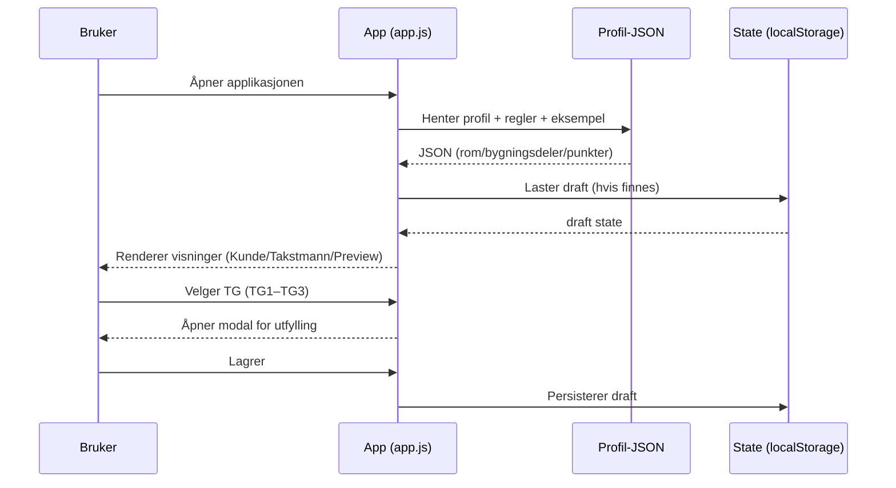
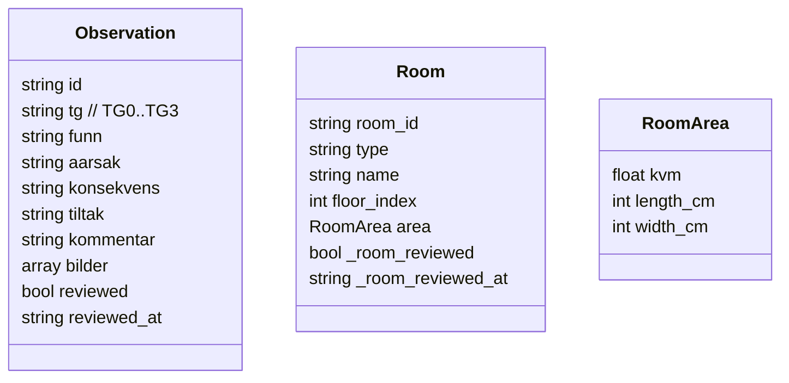
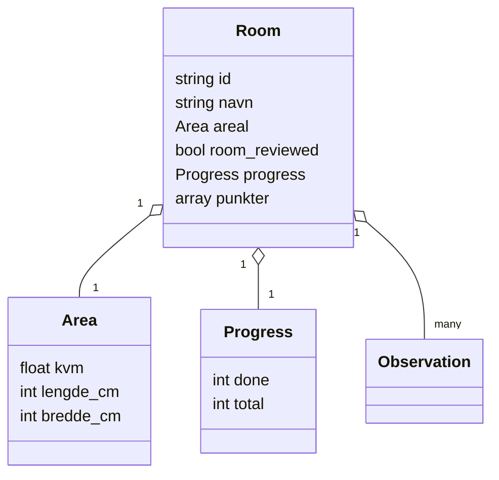
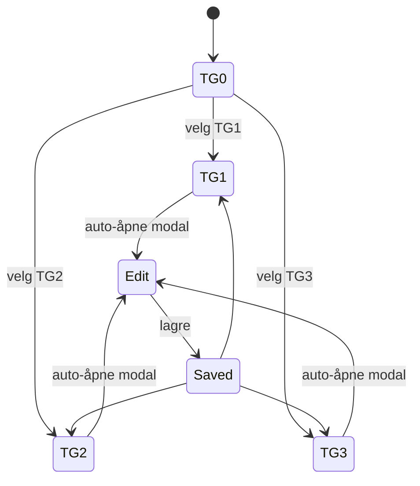

# Ekhana Takst - SPOT (Single Point of Truth)

[](https://github.com/ekhanatime/ekhana-takst)
[](LICENSE)

> **Eiendomstaksering gjort enkelt.** Moderne prototype for takstmenn som kombinerer norsk fagkunnskap med fleksibel teknologi og 3D-visualisering.

## 📋 Overview

Ekhana Takst er en statisk web-applikasjon for eiendomstaksering som løser utfordringene med tradisjonelle takstverktøy gjennom:

- **JSON-first arkitektur** med NS3600-standard
- **3D point cloud støtte** via Leica BLK2GO-integrasjon
- **Selvhostet løsning** uten eksterne avhengigheter
- **Norsk brukergrensesnitt** med responsivt design

### Kjernemål
- Gi takstmenn rask vei fra TG-valg til ferdig dokumentasjon
- Tilby kunder transparent innsyn i takstprosessen
- Levere presis 3D-dokumentasjon av eiendommer
- Muliggjøre skalerbar, kostnadseffektiv drift

## 🏗️ Detaljert Arkitektur

### Kjerneprinsipper
- **JSON-first**: UI bygges fra profil-JSON, ikke hardkodede skjema
- **Rad = signal, modal = detaljer**: tabellrad skal være skannbar, modalen er arbeidsflate
- **Fremdrift**: takstmann ser hva som er gjort/gjenstår (punkt- og rom-nivå)
- **Statisk deploy**: fungerer på enkel hosting uten backend (kan bygges ut senere)

### Høy-nivå Arkitektur
```mermaid
flowchart LR
  Browser[Browser] -->|GET| Host[Statisk hosting]
  Host -->|index.html + styles.css| Browser
  Host -->|js/app.js| Browser
  Host -->|data/ns3600_fullprofil_v1.0.0.json| Browser
  Host -->|data/property_object_generator_rules_v1.0.0.json| Browser
  Host -->|data/example_property.json| Browser
  Browser -->|localStorage (draft/utkast)| LS[(LocalStorage)]
```

### Dataflyt (Runtime)


### Domene- og UI-modell

#### Punkt (Observasjon)
Hvert punkt har TG og tilhørende forklaringsfelter.



#### Rom / Seksjon (Container)
Rom samler mange punkter og trenger fremdrift og areal.



### Viktige Arbeidsflyter

#### TG-valg → Dokumentasjon


#### Fremdrift og "OK"
- Punkt kan markeres som ferdig (check)
- Rom viser stor checkbox + `X/Y OK` for punkter
- Dette gir takstmann en "to-do"-oversikt

### Neste Iterasjoner
- Rom-areal (KVM + L/B cm) i UI og state
- Check-mark ved TG (samme størrelse), stor rom-checkbox
- Fjerne "enkeltrad før header" ved konsekvent tabellheader
- Mer modulær kode: splitte i `state`, `render`, `modal`, `helpers`

### 🚧 Under utvikling
- **3D Point Cloud Pipeline** - BLK2GO → E57 → Potree
- **Backend API** - Scan-opplasting og prosessering
- **Database-integrasjon** - Metadata-håndtering

## 🎯 Key Features

### ✅ Implementert
- **NS3600 TG-klassifisering** - Standardisert tilstandsgradering
- **JSON-drevet UI** - Fleksibel skjema-generering
- **Fremdriftssporing** - Per rom og bygningsdel
- **Kunde-onboarding** - Kartintegrasjon og eiendomsdata
- **Responsivt design** - Bootstrap 5 + mobiloptimalisering

### 💡 Fremtidsplaner
- **Multi-bruker støtte** - Team-samarbeid
- **AI-assistert taksering** - Automatisk analyse
- **Realtid-synkronisering** - Live oppdateringer
- **Mobilapp** - Native iOS/Android

## 📊 Status & Roadmap

### Nåværende Status
- **Fase**: Prototype/MVP
- **Brukere**: Lokale takstmenn (testfasen)
- **Deployment**: Statisk hosting
- **3D-støtte**: Planlagt implementering

### Neste Milepæler
- **Q1 2026**: Backend-implementasjon og 3D-pipeline
- **Q2 2026**: Database-integrasjon og brukeradministrasjon
- **Q3 2026**: Produksjonsklar versjon med full 3D-støtte
- **Q4 2026**: Mobilapp og enterprise-funksjoner

## 🤝 Development

### Bidrag
Vi ønsker bidrag! Se [CONTRIBUTING.md](./CONTRIBUTING.md) for retningslinjer.

### Utviklingsprosess
1. Opprett issue for nye features
2. Fork repository og arbeid i feature-branch
3. Følg kodestandarder og dokumentasjon
4. Submit pull request med beskrivende commit-meldinger

### Kvalitetssikring
- **Testing**: Manuell testing i moderne nettlesere
- **Linting**: ESLint for JavaScript, Stylelint for CSS
- **Tilgjengelighet**: WCAG 2.1 AA compliance
- **Ytelse**: Lighthouse score >90

## 📞 Contact

- **Issues**: [GitHub Issues](https://github.com/ekhanatime/ekhana-takst/issues)
- **Diskusjoner**: [GitHub Discussions](https://github.com/ekhanatime/ekhana-takst/discussions)
- **E-post**: Kontakt for kommersielle henvendelser

## 📄 License

MIT License - se [LICENSE](./LICENSE) for detaljer.

---

*Drevet av behovet for bedre verktøy i norsk eiendomsbransje* 🏠🇳🇴
