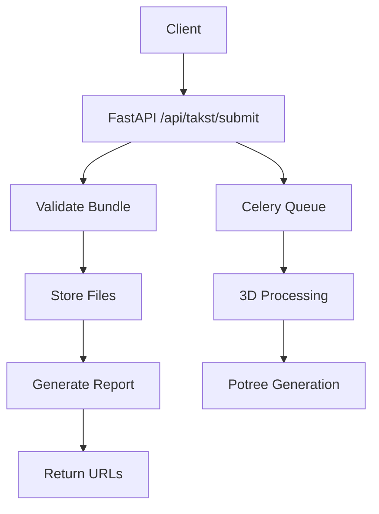
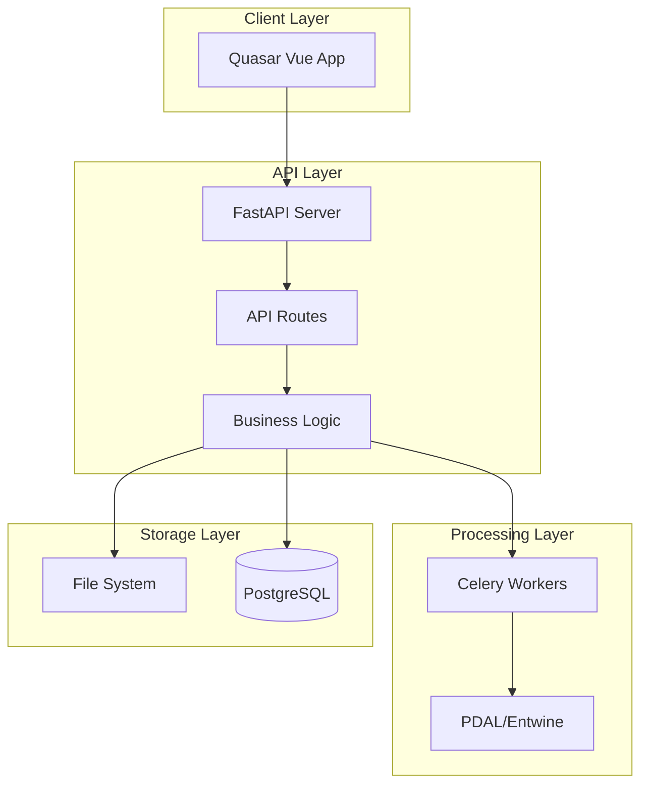

# FastAPI Backend — Overview

Provides the backend API for Ekhana Takst, handling bundle submissions, report generation, and 3D scan processing. Built with FastAPI for high performance and automatic OpenAPI documentation.

**Source Paths:**
- `backend/fastapi/main.py` (main application)
- `backend/fastapi/requirements.txt` (dependencies)
- Planned: `backend/fastapi/routes/` (API endpoints)
- Planned: `backend/fastapi/services/` (business logic)
- Planned: `backend/fastapi/models/` (data models)

**Dependencies:**
- FastAPI
- Uvicorn (ASGI server)
- Pydantic (data validation)
- Jinja2 (report templates)
- Celery (background tasks for 3D processing)
- PDAL/Entwine (3D point cloud processing)
- PostgreSQL (data storage)

**Related Links:**
- SPOT: ./SPOT.md#function-catalog
- Bundle Format: ./docs/bundle-format.md (planned)

## API

### Bundle Submission
```python
POST /api/takst/submit
Content-Type: multipart/form-data

# Bundle contains:
# - project.json (project metadata)
# - observations.json (inspection data)
# - media/ (images, videos)
# - scans/ (optional 3D scans)
```

### Scan Upload
```python
POST /api/projects/{project_id}/scans
Content-Type: multipart/form-data

# Accepts .e57 files for 3D processing
```

### Report Generation
```python
GET /api/projects/{project_id}/report
# Returns HTML + PDF report
```

### Status Endpoints
```python
GET /api/projects/{project_id}/status
# Processing status and progress
```

## Design

### Architecture
- **FastAPI Application**: Main web framework
- **Background Processing**: Celery for 3D pipeline jobs
- **File Storage**: Local filesystem with organized structure
- **Database**: PostgreSQL for metadata and user data
- **Authentication**: API key based (future)

### Bundle Processing Flow
1. Receive multipart bundle
2. Validate structure and data
3. Store files to disk
4. Generate HTML report
5. Convert to PDF (optional)
6. Return URLs for access

### 3D Pipeline Integration
- E57 file validation
- Background processing with PDAL/Entwine
- Potree format generation
- Web-accessible storage

## Usage

### Starting the Server
```bash
cd backend/fastapi
uvicorn main:app --reload
```

### API Documentation
Automatic OpenAPI docs available at `/docs` when running.

### Deployment
- Docker container with Python 3.11
- Gunicorn for production serving
- Nginx reverse proxy (recommended)

## Changelog

### [Unreleased] - 2026-01-20
- Initial implementation of FastAPI backend with bundle submission endpoint
- Added basic project structure and requirements.txt
- Created function documentation

## Diagrams

### API Flow


### Architecture Overview

