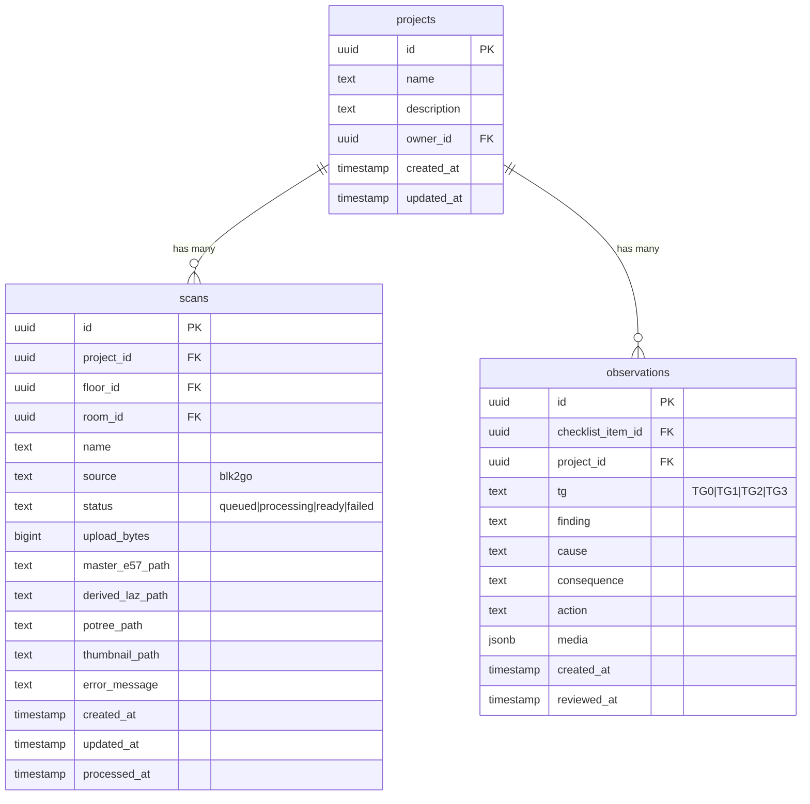

# Database Schema & ERD

## Overview

Ekhana Takst uses a hybrid storage approach:
- **Client-side**: localStorage for draft data (current implementation)
- **Server-side**: Planned PostgreSQL for production (scans, users, projects)

## Current State

### Client Storage (localStorage)
```json
{
  "assignment": {...},
  "property": {...},
  "rooms": [...],
  "observations": {...},
  "media": {...}
}
```

## Planned Database Schema

### PostgreSQL Tables (Planned)



## Migration Path

1. **Phase 1**: Client-side only (current)
2. **Phase 2**: Add server-side sync for scans
3. **Phase 3**: Full database backend
4. **Phase 4**: Multi-user collaboration

## Security Considerations

- Row Level Security (RLS) on all tables
- Encrypted storage for sensitive data
- Signed URLs for file access
- Audit logging for all changes

---

*Database schema will be updated as backend implementation progresses.*
