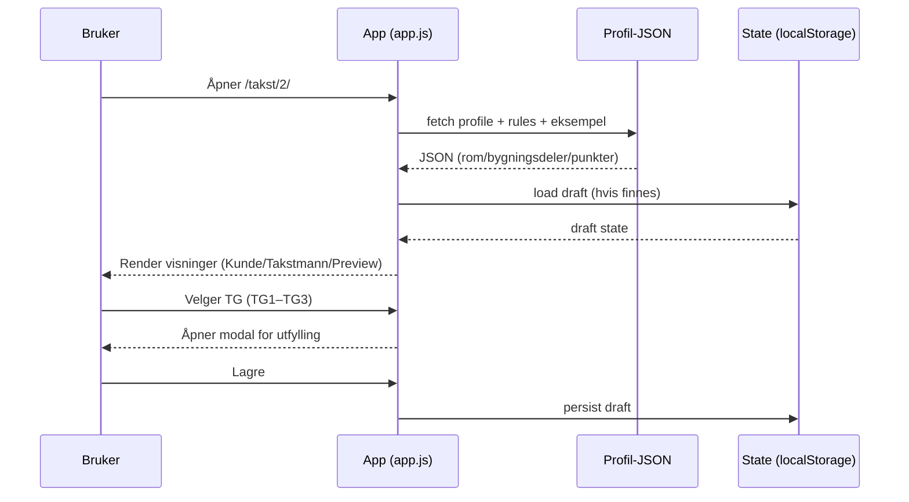
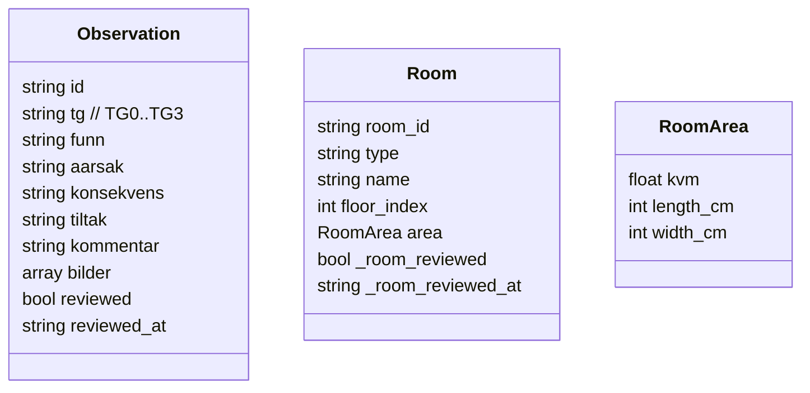
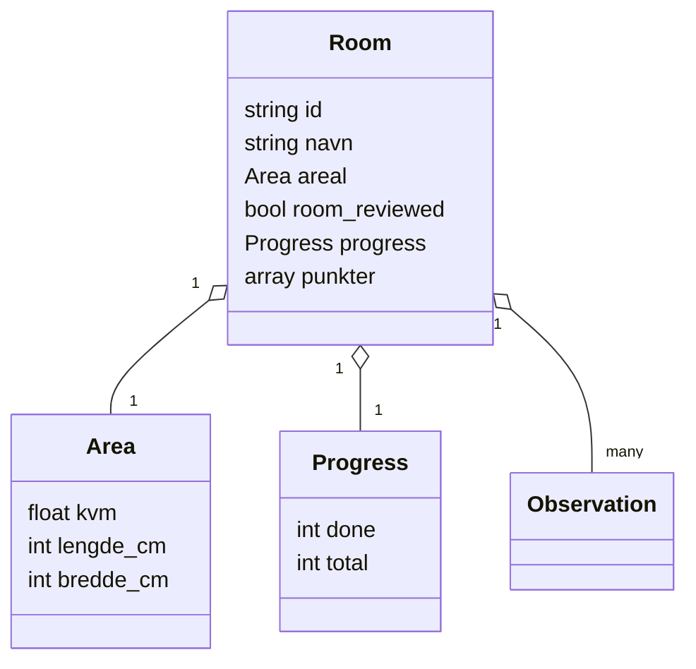
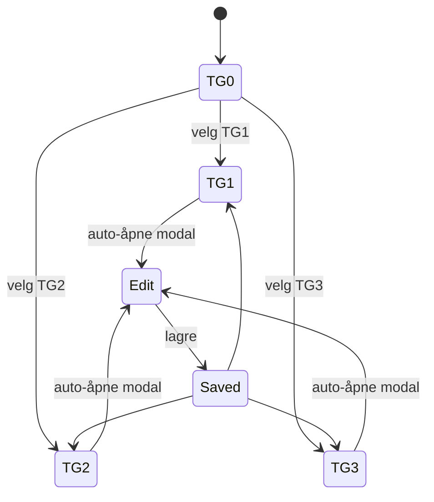

# Prosjektbeskrivelse – Ekhana Takst (JSON-first)

## 1. Formål
Ekhana Takst er en statisk, deploy-vennlig prototype for et takstverktøy der **profil-JSON** (NS3600) styrer hvilke rom/bygningsdeler, punkter og felter som finnes. Målet er å gi takstmann en rask flyt fra **TG-valg → dokumentasjon → ferdigmarkering**, og samtidig støtte kunde/preview-visninger.

## 2. Kjerneprinsipper
- **JSON-first**: UI bygges fra profil-JSON, ikke hardkodede skjema.
- **Rad = signal, modal = detaljer**: tabellrad skal være skannbar, modalen er arbeidsflate.
- **Fremdrift**: takstmann ser hva som er gjort/gjenstår (punkt- og rom-nivå).
- **Statisk deploy**: fungerer på enkel hosting uten backend (kan bygges ut senere).

## 3. Arkitektur (høy-nivå)
```mermaid
flowchart LR
  Browser[Browser] -->|GET| Host[Statisk hosting]
  Host -->|index.html + styles.css| Browser
  Host -->|js/app.js| Browser
  Host -->|js/data/ns3600_fullprofil_v1.0.0.json| Browser
  Host -->|js/data/property_object_generator_rules_v1.0.0.json| Browser
  Host -->|js/data/example_property.json| Browser
  Browser -->|localStorage (draft/utkast)| LS[(LocalStorage)]
```

## 4. Dataflyt (runtime)


## 5. Domene- og UI-modell
### 5.1 Punkt (observasjon)
Hvert punkt har TG og tilhørende forklaringsfelter.



### 5.2 Rom / seksjon (container)
Rom samler mange punkter og trenger fremdrift og areal.



## 6. Viktige arbeidsflyter
### 6.1 TG-valg → dokumentasjon
- Takstmann klikker TG på en rad.
- Når TG endres fra TG0 til TG1–TG3, skal modal åpnes automatisk.
- Modalen viser kompakte felter (funn/årsak/konsekvens/tiltak) og tydelig hva som mangler.



### 6.2 Fremdrift og “OK”
- Punkt kan markeres som ferdig (check).
- Rom viser stor checkbox + `X/Y OK` for punkter.
- Dette gir takstmann en “to-do”-oversikt.

## 7. Videre arbeid (neste iterasjoner)
- Legge inn rom-areal (KVM + L/B cm) i UI og i state.
- Implementere check-mark ved TG (samme størrelse), samt stor rom-checkbox.
- Fjerne “enkeltrad før header” ved å rendere tabellheader konsekvent.
- Mer modulær kode: splitte i `state`, `render`, `modal`, `helpers` (før fysisk splitting i flere filer).
